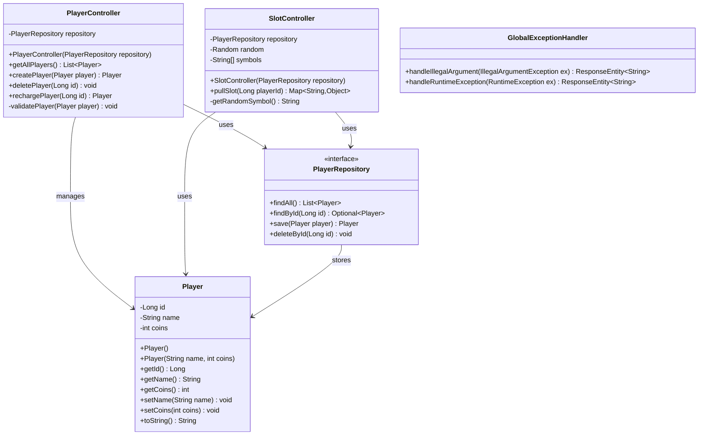

# Klassendiagramm - Slot Machine Casino

## UML Klassendiagramm

## Erklärung der Beziehungen

- **PlayerController** verwaltet Player-Entitäten über das PlayerRepository
- **SlotController** nutzt Player-Daten für Spiellogik über das PlayerRepository  
- **PlayerRepository** ist die Datenzugriffsschicht für Player-Entitäten
- **GlobalExceptionHandler** behandelt Exceptions global für alle Controller
- **Player** ist die zentrale Entität mit Attributen id, name und coins

## Technologie-Stack
- **Backend**: Spring Boot 3.5.3 mit JPA/Hibernate
- **Database**: MySQL für Persistierung
- **Frontend**: React 19.1.0 mit Vite
- **Testing**: Vitest mit React Testing Library
