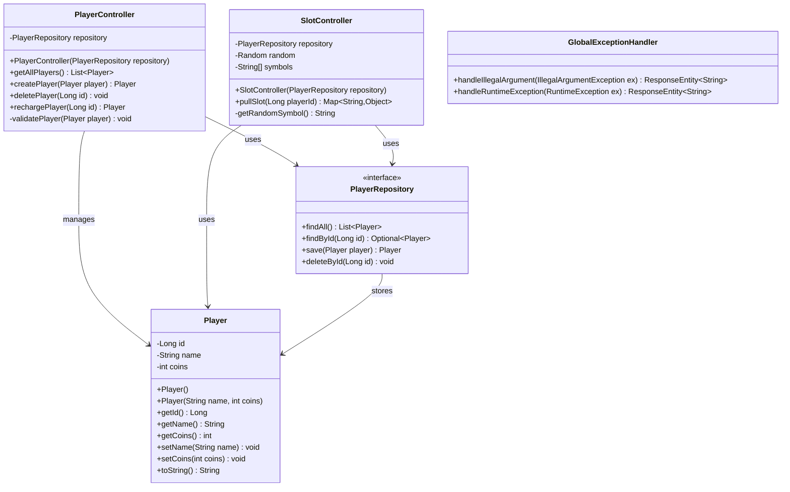
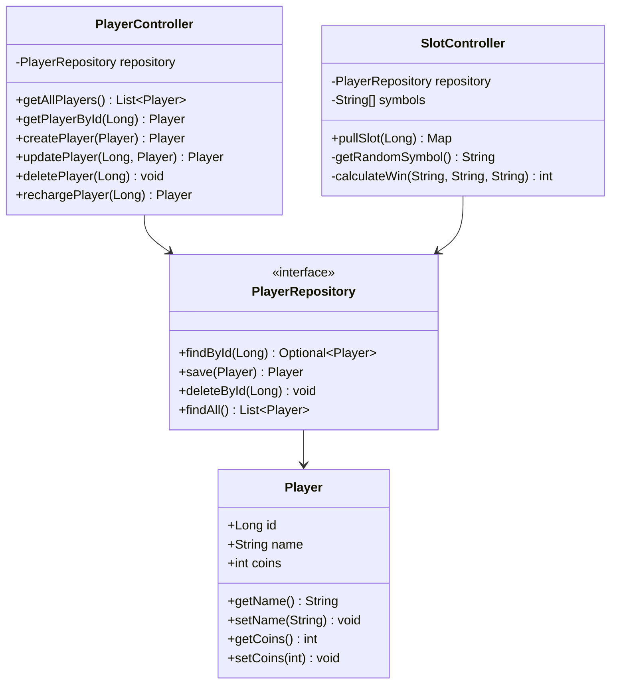
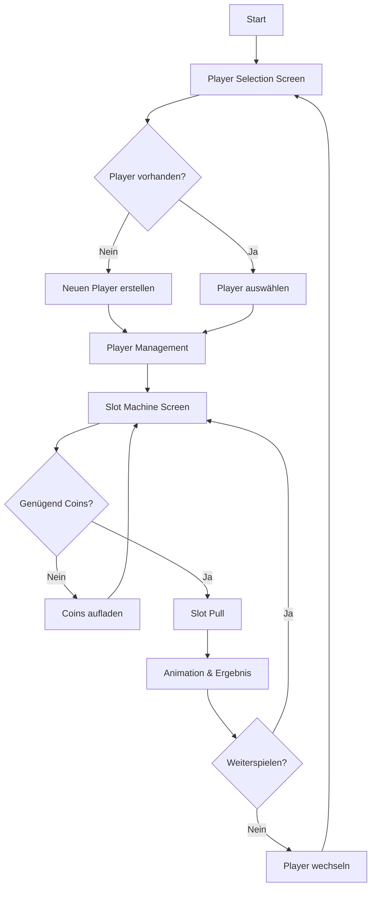

# Projektdokumentation - Slot Machine Casino
**Modul M294 - Frontend Development**
**Name:** Dusan Stevic
**Datum:** 11.07.2025

---

## 1. Projektidee

### Elevator Pitch
Das **Slot Machine Casino** ist eine vollständige Casino-Simulation mit Spielerverwaltung und realistischer Slot Machine. Spieler können sich registrieren, Coins verwalten und an einer 3-Reel Slot Machine mit verschiedenen Gewinnkombinationen spielen. Die Anwendung kombiniert ein Spring Boot REST-API Backend mit einem modernen React Frontend und bietet eine authentische Casino-Erfahrung mit Animationen, Gewinnlogik und persistenter Datenhaltung.

**Kernfunktionen:**
- Player Management (CRUD)
- Slot Machine mit realistischen Gewinnchancen
- Coin-System mit Aufladung
- Casino-Design mit Animationen
- MySQL Datenpersistierung

---

## 2. Anforderungskatalog

### User Story 1: Player Registration
**Als** neuer Benutzer  
**möchte ich** mich als Spieler registrieren können  
**damit ich** am Casino teilnehmen kann

**Akzeptanzkriterien:**
- ✅ Spielername muss eingegeben werden
- ✅ Start-Coins können festgelegt werden (Standard: 1000)
- ✅ Spieler wird in Datenbank gespeichert
- ✅ Validation: Name darf nicht leer sein

### User Story 2: Slot Machine Spielen
**Als** registrierter Spieler  
**möchte ich** an der Slot Machine spielen können  
**damit ich** Coins gewinnen kann

**Akzeptanzkriterien:**
- ✅ 10 Coins Einsatz pro Spiel
- ✅ 3 zufällige Symbole werden generiert
- ✅ Gewinn bei 3 gleichen Symbolen
- ✅ Coins werden automatisch aktualisiert
- ✅ Animation während des Spiels

### User Story 3: Coin Management
**Als** Spieler  
**möchte ich** meine Coins verwalten können  
**damit ich** weiterspielen kann

**Akzeptanzkriterien:**
- ✅ Aktuelle Coins werden angezeigt
- ✅ Coins können aufgeladen werden
- ✅ Spiel nur bei genügend Coins möglich
- ✅ Coin-Änderungen werden gespeichert
- ✅ Maximale Coins begrenzt auf 1000

---

## 3. Klassendiagramm

### UML Klassendiagramm



**Erklärung der Beziehungen:**
- PlayerController verwaltet Player-Entitäten über das PlayerRepository
- SlotController nutzt Player-Daten für Spiellogik über das PlayerRepository  
- PlayerRepository ist die Datenzugriffsschicht für Player-Entitäten
- Player ist die zentrale Entität mit Attributen id, name und coins

**Akzeptanzkriterien:**
- ✅ Aktuelle Coins werden angezeigt
- ✅ Coins können aufgeladen werden
- ✅ Spiel nur bei genügend Coins möglich
- ✅ Coin-Änderungen werden gespeichert

### User Story 4: Player Verwaltung
**Als** Spieler  
**möchte ich** meinen Account verwalten können  
**damit ich** die Kontrolle über meine Daten habe

**Akzeptanzkriterien:**
- ✅ Player können gelöscht werden
- ✅ Bestätigungsdialog vor Löschung
- ✅ Player-Wechsel jederzeit möglich
- ✅ Übersichtliche Player-Auswahl

### User Story 5: Benutzerfreundlichkeit
**Als** Benutzer  
**möchte ich** eine intuitive Casino-Erfahrung  
**damit ich** das Spiel sofort verstehe

**Akzeptanzkriterien:**
- ✅ Animationen für bessere UX
- ✅ Klare Gewinn/Verlust Anzeigen
- ✅ Responsive Design
- ✅ Casino-typisches Design
- ✅ Einfache Navigation

---

## 3. Klassendiagramm



---

## 4. Storyboard

### Hauptablauf der Anwendung



### Use Case: Slot Machine Spielen
1. **Player auswählen** → Dropdown-Liste
2. **"Pull Lever" klicken** → Animation startet
3. **Reels drehen** → 3 Sekunden Animation
4. **Ergebnis anzeigen** → Gewinn/Verlust Message
5. **Coins aktualisieren** → Neue Coin-Anzahl

---

## 5. Screen-Mockups

### Screen 1: Player Selection
```
+----------------------------------+
|        🎰 CASINO ROYALE         |
+----------------------------------+
| 👤 Neuen Spieler erstellen      |
| [Spielername........] [1000]    |
| [Erstellen]                      |
|                                  |
| 🎮 Spieler auswählen            |
| [Dropdown: Max (500 Coins) ▼]   |
| [Spielen]                        |
+----------------------------------+
```

### Screen 2: Slot Machine
```
+----------------------------------+
|   Spieler: Max | Coins: 500     |
+----------------------------------+
|                                  |
|     🍒    🍋    💎              |
|    [===] [===] [===]             |
|                                  |
|        [PULL LEVER] 🔴          |
|                                  |
|      Einsatz: 10 Coins          |
|                                  |
| [Aufladen] [Player wechseln]    |
+----------------------------------+
```

---

## 6. REST-Schnittstellen

### Player Endpoints

#### GET /player
**Beschreibung:** Alle Spieler abrufen  
**Response:**
```json
[
  {
    "id": 1,
    "name": "Max",
    "coins": 500
  }
]
```

#### POST /player
**Beschreibung:** Neuen Spieler erstellen  
**Request Body:**
```json
{
  "name": "Max",
  "coins": 1000
}
```
**Response:** Created Player Object

#### PUT /player/recharge/{id}
**Beschreibung:** Spieler-Coins aufladen (+1000)  
**Response:** Updated Player Object

#### DELETE /player/{id}
**Beschreibung:** Spieler löschen  
**Response:** 200 OK

### Slot Endpoints

#### POST /slot/pull/{playerId}
**Beschreibung:** Slot Machine ziehen  
**Response:**
```json
{
  "slots": ["🍒", "🍒", "🍒"],
  "win": true,
  "winAmount": 100,
  "coins": 590,
  "player": {
    "id": 1,
    "name": "Max",
    "coins": 590
  }
}
```

**Error Response:**
```json
{
  "error": "Not enough coins"
}
```

---

## 7. Testplan

### Testfall 1: Player erstellen
**Vorbedingung:** Anwendung läuft  
**Schritte:**
1. Namen "TestUser" eingeben
2. Coins "1500" eingeben  
3. "Erstellen" klicken
**Erwartetes Ergebnis:** Player erscheint in Dropdown, DB-Eintrag erstellt

### Testfall 2: Slot Machine - Erfolgreich
**Vorbedingung:** Player mit ≥10 Coins ausgewählt  
**Schritte:**
1. "Pull Lever" klicken
2. Animation abwarten
**Erwartetes Ergebnis:** 10 Coins abgezogen, Ergebnis angezeigt

### Testfall 3: Slot Machine - Nicht genügend Coins
**Vorbedingung:** Player mit <10 Coins ausgewählt  
**Schritte:**
1. "Pull Lever" klicken
**Erwartetes Ergebnis:** Button disabled oder Error-Message

### Testfall 4: Coins aufladen
**Vorbedingung:** Player ausgewählt  
**Schritte:**
1. "Aufladen" klicken
**Erwartetes Ergebnis:** +1000 Coins hinzugefügt

### Testfall 5: Player löschen
**Vorbedingung:** Player ausgewählt  
**Schritte:**
1. "Löschen" klicken
2. Bestätigung "Ja"
**Erwartetes Ergebnis:** Player aus DB entfernt, zur Auswahl zurück

---

## 8. Test-Durchführung

### Testfall 1: Player erstellen ✅
**Durchgeführt am:** 11.07.2025  
**Ergebnis:** BESTANDEN  
**Bemerkung:** Player wird korrekt erstellt und in Dropdown angezeigt

### Testfall 2: Slot Machine - Erfolgreich ✅
**Durchgeführt am:** 11.07.2025  
**Ergebnis:** BESTANDEN  
**Bemerkung:** Animation läuft, Coins werden korrekt abgezogen

### Testfall 3: Slot Machine - Nicht genügend Coins ✅
**Durchgeführt am:** 11.07.2025  
**Ergebnis:** BESTANDEN  
**Bemerkung:** Button wird automatisch disabled

### Testfall 4: Coins aufladen ✅
**Durchgeführt am:** 11.07.2025  
**Ergebnis:** BESTANDEN  
**Bemerkung:** 1000 Coins werden korrekt hinzugefügt

### Testfall 5: Player löschen ✅
**Durchgeführt am:** 11.07.2025  
**Ergebnis:** BESTANDEN  
**Bemerkung:** Player wird aus DB entfernt, UI kehrt zur Auswahl zurück

---

## 8.1. Unit-Test Durchführung

### Unit-Test 1: App Rendering ✅
**Test:** App renders without crashing  
**Durchgeführt am:** 17.07.2025  
**Ergebnis:** BESTANDEN  
**Bemerkung:** App lädt ohne Fehler und zeigt Casino-Titel

### Unit-Test 2: Form Validation ✅
**Test:** Player creation form validation works  
**Durchgeführt am:** 17.07.2025  
**Ergebnis:** BESTANDEN  
**Bemerkung:** Eingabefelder haben korrekte min/max Attribute

### Unit-Test 3: Player Creation ✅
**Test:** Player can be created with valid data  
**Durchgeführt am:** 17.07.2025  
**Ergebnis:** BESTANDEN  
**Bemerkung:** API-Call wird korrekt ausgeführt

### Unit-Test 4: Player Selection ✅
**Test:** Player selection shows game screen  
**Durchgeführt am:** 17.07.2025  
**Ergebnis:** BESTANDEN  
**Bemerkung:** Navigation zur Slot Machine funktioniert

### Unit-Test 5: Slot Button Disabled ✅
**Test:** Slot machine button disabled when insufficient coins  
**Durchgeführt am:** 17.07.2025  
**Ergebnis:** BESTANDEN  
**Bemerkung:** Button ist disabled bei < 10 Coins

**Test-Kommando:** `npm test`  
**Test-Framework:** Vitest mit React Testing Library  
**Coverage:** 5/5 Tests erfolgreich

---

## 9. Installationsanleitung

### Voraussetzungen
- Java 17+
- Node.js 18+
- MySQL Server (läuft auf localhost:3306)
- Maven

### Setup-Schritte
1. **Repository klonen/entpacken**
2. **MySQL Datenbank erstellen:**
   ```sql
   CREATE DATABASE slotmachine;
   ```
3. **Backend-Konfiguration prüfen:**
   - Datei: `backend/src/main/resources/application.properties`
   - MySQL-Credentials anpassen falls nötig
4. **Projekt starten:**
   - Windows: `start-all.cmd` doppelklicken
   - Manual: Backend und Frontend separat starten

### URLs nach Start
- Frontend: http://localhost:5173
- Backend API: http://localhost:8080
- API Test: http://localhost:8080/player

---

## 10. Hilfestellungen

### Verwendete Ressourcen
- **Spring Boot Dokumentation:** https://spring.io/projects/spring-boot
- **React Dokumentation:** https://react.dev/
- **CSS Animations:** MDN Web Docs
- **MySQL Setup:** Unterrichtsmaterialien M294
- **Stack Overflow:** Für spezifische Implementierungsfragen
- **GitHub Copilot:** Code-Completion und Debugging-Hilfe

### Unterstützung von Mitstudierenden
- Diskussion über REST-API Design
- Code-Review für React Components
- Hilfe bei MySQL-Konfiguration

### Dozentenberatung
- Validierung der Projektidee
- Feedback zu Architektur-Entscheidungen
- Hilfe bei Spring Boot Configuration
