# 📊 Mermaid Diagramme - Slot Machine Casino

## Klassendiagramm

---

## Application Flow Diagramm

```mermaid
flowchart TD
    A[START] --> B[Player Selection Screen]
    B --> C{Neuen Player erstellen?}
    C -->|JA| D[Player Form]
    D --> E[Player erstellt]
    E --> F[Existierenden Player wählen]
    C -->|NEIN| F
    F --> G[Slot Machine Screen]
    G --> H{Genügend Coins?}
    H -->|NEIN| I[Coins aufladen]
    I --> G
    H -->|JA| J[Slot Pull - 10 Coins]
    J --> K[Animation - 3 Sekunden]
    K --> L[Ergebnis anzeigen]
    L --> M{Gewinn?}
    M -->|JA| N[Coins hinzufügen]
    M -->|NEIN| O{Weiterspielen?}
    N --> O
    O -->|JA| G
    O -->|NEIN| P[Player wechseln]
    P --> B
```

---

## API Sequenz Diagramm

---

## Slot Machine Game Logic

```mermaid
flowchart TD
    A[Slot Pull Start] --> B[Validate Player & Bet]
    B --> C{Player exists & enough coins?}
    C -->|NEIN| D[Throw Exception]
    C -->|JA| E[Deduct 10 Coins]
    E --> F[Generate 3 Random Symbols]
    F --> G{All 3 symbols same?}
    G -->|JA| H[Calculate Win Multiplier]
    H --> I[💎💎💎 = Bet × 50]
    H --> J[⭐⭐⭐ = Bet × 20]
    H --> K[🔔🔔🔔 = Bet × 15]
    H --> L[🍉🍉🍉 = Bet × 10]
    H --> M[🍋🍋🍋 = Bet × 7]
    H --> N[🍒🍒🍒 = Bet × 5]
    I --> O[Add winnings to coins]
    J --> O
    K --> O
    L --> O
    M --> O
    N --> O
    G -->|NEIN| P[No win - coins stay deducted]
    O --> Q[Save updated Player]
    P --> Q
    Q --> R[Return game result JSON]
```

## System Architecture

## Entity Relationship Diagram

